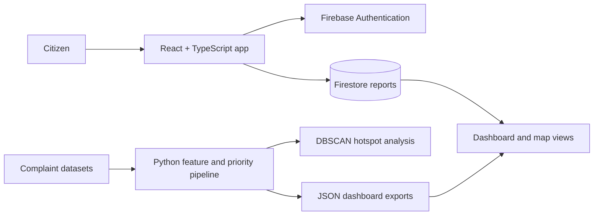

# Civic Lens Architecture

Civic Lens is a React and Firebase application backed by a reproducible Python analytics pipeline.

## Runtime Flow

## Application

- `app/src/pages` contains route-level screens for reporting, report history, maps, dashboards, and administration.
- `app/src/components` contains reusable forms, cards, maps, charts, and navigation.
- Firebase Authentication protects application routes.
- Firestore stores submitted reports and status updates.
- Leaflet renders report locations and hotspot context in the map views.

## Analytics Pipeline

The `ml/` and `research/` workflows normalize complaint data, engineer category/status/spatial features, and compare classification models. Priority labels are produced from a domain-informed score, while DBSCAN groups nearby reports into spatial hotspots. Exported JSON files in `app/public/` are consumed by the frontend for fast dashboard rendering.

The research workflow additionally evaluates transfer from synthetic Bhopal-style data to NYC 311 data. That result is treated as validation evidence, not as a claim that one city's model is production-ready for another city.

## Boundaries

The current frontend performs lightweight live inference for newly submitted reports. Batch model training and deeper inference remain offline Python workflows. A future backend inference service can move those responsibilities behind an authenticated API without changing the report and dashboard contracts.
